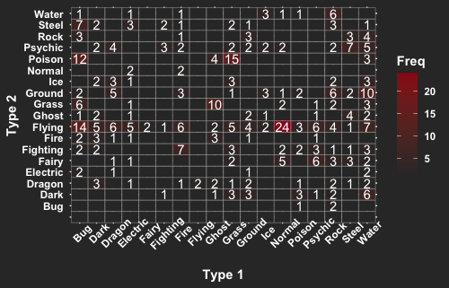

# Final Project: Pokémon Demography
##### Ying Zhao, ying_zhao@berkeley.edu

##### Pokémon are creatures of various types. There are 800 Pokémon inhabiting in the Pokémon universe, waiting for the right trainer to catch, train, and love them. Most Pokémon has two types, Type 1 and Type 2. It's interesting to explore the distribution of types and the relationship between them.

##### Pokémon with their primary type.

##### Pokémon Types Distribution.

##### Pokemon Generation and Type

######(Data source: Kaggle, Data Visualization: Ying Zhao)

